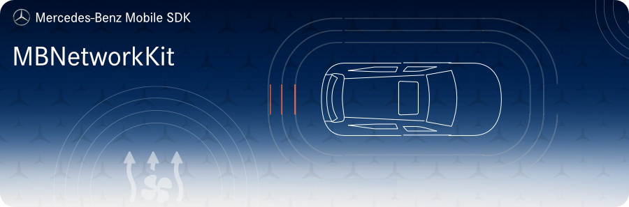

<!-- SPDX-License-Identifier: MIT -->




## Requirements
* __Minimum Android SDK:__ MBNetworkKit requires a minimum API level of 21. 
* __Compile Android SDK:__ MBNetworkKit requires you to compile against minimum API level 27.

## Intended Usage

This module contains basic and utility implementations for network requests using _Retrofit_ and for socket connections 
using `OkHttp`.

## Installation

Add the following maven url to your project `build.gradle`:  
```gradle
allprojects {
    repositories {
        google()
        jcenter()
        maven {
            url 'https://pkgs.dev.azure.com/daimler-ris/sdk/_packaging/release/maven/v1'
        }
    }
}
```

Add to your app's `build.gradle`:  
```gradle
implementation "com.daimler.mm:MBNetworkKit:$mb_network_kit_version"
```

## Contributing

We welcome any contributions.
If you want to contribute to this project, please read the [contributing guide](https://github.com/Daimler/MBSDK-NetworkKit-Android/blob/master/CONTRIBUTING.md).

## Code of Conduct

Please read our [Code of Conduct](https://github.com/Daimler/daimler-foss/blob/master/CODE_OF_CONDUCT.md) as it is our base for interaction.

## License

This project is licensed under the [MIT LICENSE](https://github.com/Daimler/MBSDK-NetworkKit-Android/blob/master/LICENSE).

## Provider Information

Please visit <https://mbition.io/en/home/index.html> for information on the provider.

Notice: Before you use the program in productive use, please take all necessary precautions,
e.g. testing and verifying the program with regard to your specific use.
The program was tested solely for our own use cases, which might differ from yours.
